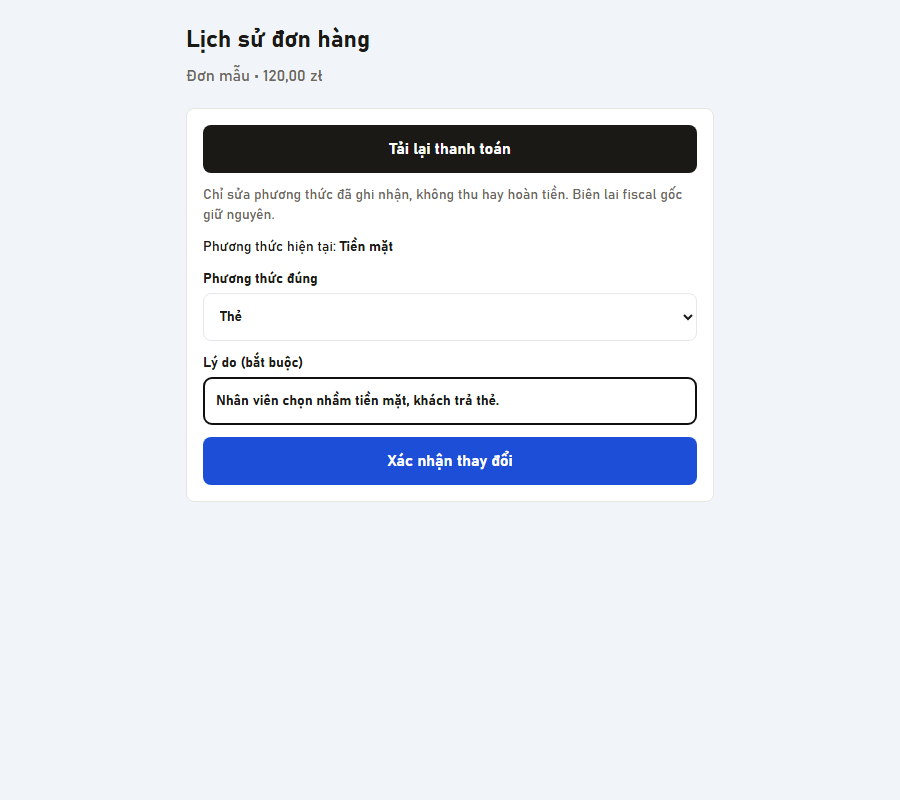

# History payment correction

The history detail has a dedicated payment-method correction panel. It fetches the current server payment/version, requires a reason and preserves a stable request ID on retries. No amount, stock, terminal charge/refund or fiscal printing action is performed.

Backend companion: eNail branch `feat/pos-payment-correction-20260908`, implementation and rollout described in `docs/POS_PAYMENT_CORRECTION.md` in that repository. Requires GET/PATCH `/api/v1/b2b/pos/orders/:id/payment` on the backend; update backend before shop clients.

Eligible synchronized, completed single-method orders can switch between CASH, CARD, BLIK and BANK_TRANSFER. Closed shifts require owner/manager. Terminal/gateway transactions, linked invoices, refunded/cancelled orders, protected/split methods, inconsistent amounts and missing original shifts receive a reason instead of a misleading success. Unsynced orders wait for normal synchronization first.

Shared inbound sync applies canonical payment/tender amounts to existing local orders. Older payment snapshots cannot overwrite a newer HTTP correction. Other updated POS clients receive the backend's durable sync log entry.

Validation on GM: 256 tests passed (correction panel, order/refund sync and IPC contracts); full build passed. Edge fixture smoke and screenshot passed. Backend companion has 24 passing tests including real PostgreSQL rollback/concurrency checks. No production installation or shop restart was performed.

